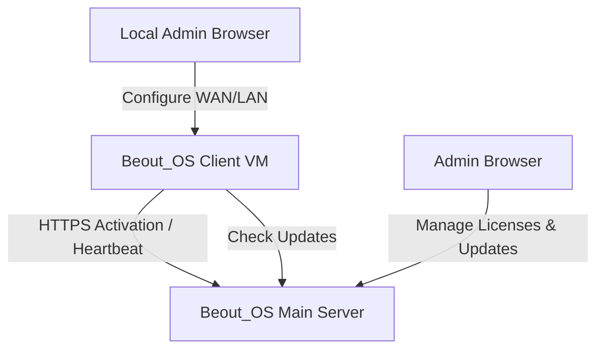
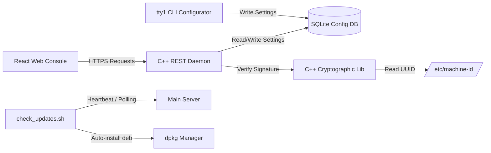

# Beout_OS Architecture Guide

This document describes the high-level system layout, networking topology, components, and data flows of Beout_OS.

---

## 1. System Topology Overview

Beout_OS is designed as a hybrid network security appliance system consisting of:
1. **VM Client Appliance**: The locked-down OS running inside hypervisors (KVM, ESXi, etc.).
2. **Main Management Server**: The central controller managing license authorizations and distributing software updates.

---

## 2. Software Architecture (Client VM)

The client appliance uses a microservices architecture built around a single SQLite3 configuration engine:

### Components:
* **C++ REST Daemon (`beout_os_api`)**: An HTTPS server built on `cpp-httplib` and `OpenSSL`. Serves the built React SPA and handles REST routing.
* **CLI Configurator (`beout_os_provisioning`)**: Takes over the primary local console (`tty1`), preventing access to a Linux shell. Prompts for interface IPs, netmasks, and gateways.
* **SQLite Configuration DB**: Serves as the single source of truth for the appliance.
* **Cryptographic Lib (`activation`/`crypto`)**: Performs local hardware-lock calculations. Reads `/etc/machine-id` and verifies ed25519 signatures using the public key.
* **Auto-Updater (`check_updates.sh`)**: Polling client that handles pings to the central server and downloads/applies package updates.

---

## 3. Data Flow Mappings

### Activation Sequence:
1. Administrator enters the license key into the React console.
2. Web UI sends `POST /api/license/activate` with key.
3. Client daemon fetches `machine_id` (`/etc/machine-id`) and forwards activation to the Main Server.
4. Main Server validates key status, signs `machine_id` with Ed25519 private key, and returns the signature (`activation_token`).
5. Client daemon validates signature using the public key PEM.
6. On success, `activation_status` is marked `ACTIVE` in local DB, opening configuration routes.

### Heartbeat & Self-Deactivation Sequence:
1. Every 5 seconds, systemd timer runs `check_updates.sh`.
2. Script polls Main Server `/api/license/heartbeat` with machine parameters.
3. If Main Server responds with `REVOKED` or `INACTIVE`, script executes:
   * Local SQLite state is reset to `INACTIVE`.
   * Web UI console immediately locks up.
