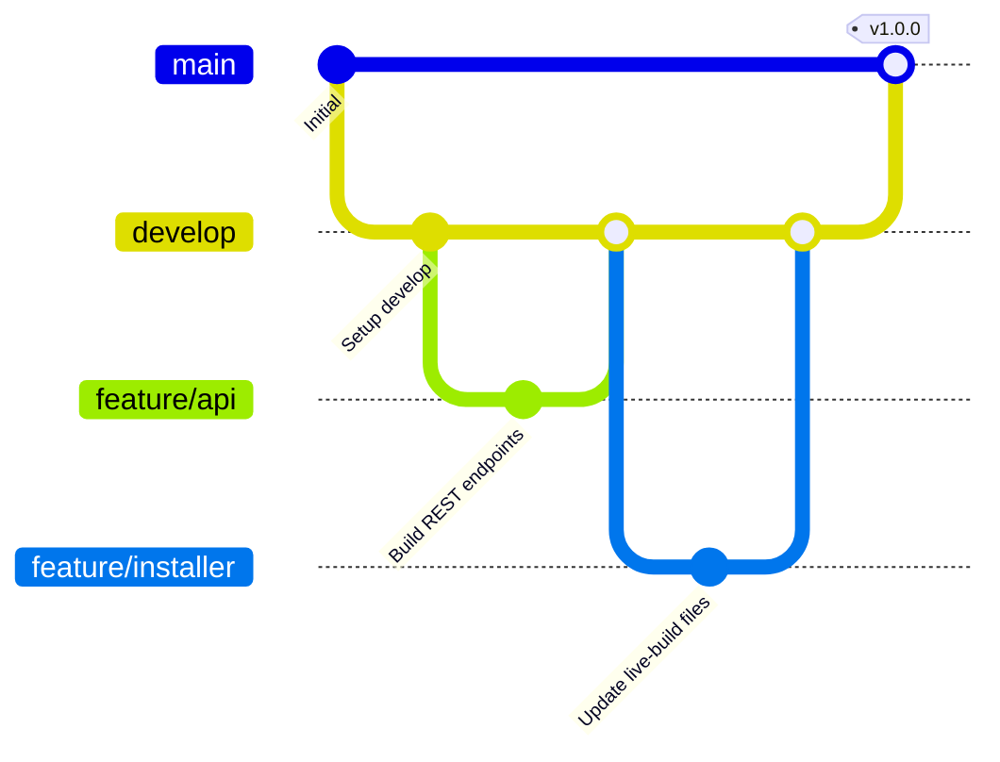

# Beout_OS Developer & Git Strategy Guide

This guide details codebase extensions, programming standards, and the branching strategy for development.

---

## 1. Git Branching Strategy

To maintain release stability, direct commits to `main` are strictly prohibited. Developers must follow this branch naming structure:

### Branch Categories:
* **`main`**: Production releases. Contains stable, bootable ISO tag milestones.
* **`develop`**: Central integration branch. All feature branches are merged here first.
* **Feature Branches**: Dedicated branches for specific subsystem enhancements:
  * `feature/provisioning`: Local setup CLI tool edits.
  * `feature/licensing`: Cryptographic checks and server heartbeat logic.
  * `feature/api`: C++ REST daemon modifications.
  * `feature/dashboard`: React SPA elements.
  * `feature/installer`: ISO generation scripts and AppArmor configs.

### Pull Request & Integration Rules:
1. Branch off `develop`.
2. Implement and verify unit tests (`./build.sh test`).
3. Create a pull request targeting `develop`.
4. After review and CI validation, merge into `develop`.
5. When preparing a release, `develop` is merged into `main` and tagged with the version.

---

## 2. Codebase Standards

* **C++ Code**:
  * Adhere to C++20 standards.
  * Follow RAII (Resource Acquisition Is Initialization) strictly. Use smart pointers (`std::unique_ptr`, `std::shared_ptr`) rather than raw pointers.
  * Keep header includes minimal to reduce compile times.
* **Web UI (React)**:
  * Implement type safety with TypeScript.
  * Use the glassmorphism CSS theme tokens declared in `App.css`.
* **PHP Code**:
  * Use strict typing and parameter binding (PDO prepared statements) for SQL queries.
  * Modularize logic inside dedicated classes.
